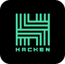
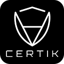
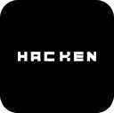

# QANX token

## What is QANX?

QANX token is an ERC20/BEP20 compliant token optimized for trading on Decentralized Exchanges (DEX) with customizable locking and vesting options included.

A previous version of the QANX token was also prepared with a mapping designed to store Post-Quantum cryptography public key hashes, which will technically enable a direct migration from the ERC20 and BEP20 tokens to QANplatform's upcoming native mainnet units which will utilize PQ cryptography by default.

In the current iteration this functionality is removed from the QANX token contract, as the XLINK protocol allowing the PQ migration desribed above will enable ANY Ethereum account to make the migration to QAN's mainnet without the requirement of QANX token ownership. For this reason the XLINK helper contract enabling this functionality will be uploaded to GitHub as a new project in a separete repository and deployed on the respective networks later, after which this doumentation will be updated to reflect the resulting contract address.

You can browse the live instances of QANX smart contracts below:

- ETH (ERC20): [TBA](#) [ Ethereum ]
- BSC (BEP20): [TBA](#) [ Binance Smart Chain ]

---

## Structure

The QANX smart contract is built on top of the industry standard OpenZeppelin smart contracts.

### OpenZeppelin contract modifications

The OpenZeppelin contracts are not imported directly, because they are slightly modified. Anyone can compare against the orignal version, the base version used is release [v4.8.1](https://github.com/OpenZeppelin/openzeppelin-contracts/tree/v4.8.1/contracts/token/ERC20).
The following modifications were done to the base contracts to optimize gas fees and enable extended functionality:

- Lock floating Solidity pragma to version 0.8.17 
- Update import paths according to project layout
- Modify function visibilities from public to external to optimize gas
- Modifiy ```_balances``` and ```_allowances``` mapping visibility to internal

## Audits 2023:

### Audit by Omniscia 

We are proud that the most recent QANX smart contract also passed Omniscia's audit excellently. You can find the latest audit report [here](./audit/Omniscia-QANplatform-20022023.pdf).

Omniscia is a leading Web3 security firm with deep experience securing and optimizing complex smart contracts and blockchain networks.

Other than QANX the audit firm Omniscia was also assigned to audit: Polygon and Ava Labs just to name a few.

---

### Audit by Hacken 

We are proud that the most recent QANX smart contract also passed Hacken's audit excellently with a score of 10/10. You can find the latest audit report [here](./audit/Hacken-QANplatform-20022023.pdf).

Hacken is a leading cybersecurity consulting company with an essential focus on blockchain security. Hacken Cybersecurity Services is a part of Hacken Group, including CER.live, HackenAI, Trust Army, Hextractor, and HackenProof. From June 2020, CER.live is the unique cybersecurity data provider for CoinGecko Trust Score.

Other than QANX the audit firm Hacken was also assigned to audit the recognizable Gate.io, Bithumb Global, and 1inch just to name a few.

---

## Previous audits:
### Audit by CertiK 

We are proud that QANX smart contract passed CertiK's audit excellently. You can find the audit report [here](./audit/REP-QANX-2021-05-28.pdf).

CertiK leads blockchain security by pioneering the use of cutting-edge Formal Verification technology on smart contracts and blockchains. Unlike traditional security audits, Formal Verification mathematically proves program correctness and hacker-resistance.

Other than QANX the audit firm CertiK was also assigned to audit the recognizable PancakeSwap, 1inch, Tether and Matic just to name a few.

---

### Audit by Hacken 

We are proud that QANX smart contract passed Hacken's audit excellently. You can find the audit report [here](./audit/Hacken-QANplatform-29032022.pdf).

Hacken is a leading cybersecurity consulting company with an essential focus on blockchain security. Hacken Cybersecurity Services is a part of Hacken Group, including CER.live, HackenAI, and HackenProof. From June 2020, CER.live is the unique cybersecurity data provider for CoinGecko Trust Score.

Other than QANX the audit firm Hacken was also assigned to audit the recognizable Gate.io, FTX, Bithumb Global, and 1inch just to name a few.

---
## How to compile & test

If you are still curious about how QANX works and want to verify yourself (awesome, you always should!), you can compile and test it easily with Docker. Just run the following command:

```docker build -t qanx . && docker run --rm -v $PWD/out:/out qanx```

This will compile the contract, put the built artifacts into the ```out``` directory in your current path then run all unit tests.

If you want to inspect the test coverage report, append "coverage" to the docker run command like this:

```
docker run --rm -v $PWD/out:/out qanx coverage
```
